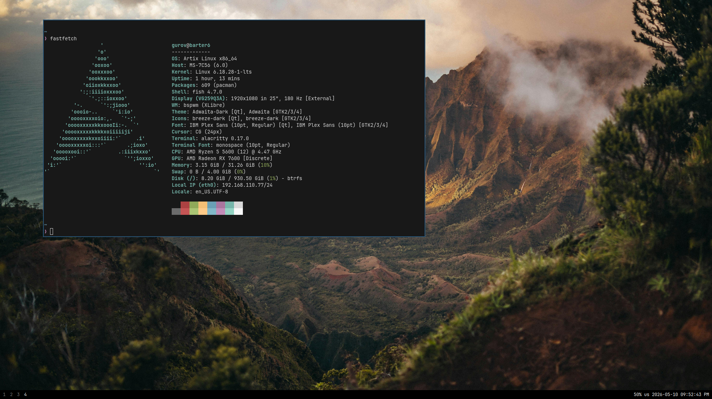

# bspbar

`bspbar` is a small X11 bar for `bspwm`, written entirely in C.



It keeps the `mangobar` shape, but the implementation is now native and purpose-built:

- visible desktops on the left
- volume, keyboard layout, and clock on the right
- click desktops to focus them
- scroll to move across visible desktops
- source-level configuration through `config.h`

Scope is intentionally narrow:

- `bspwm` only
- X11 only
- C only
- no runtime config file

## Dependencies

- `bspwm` and `bspc`
- X11 and XKB development files
- Cairo and Pango development files
- PipeWire development files

On many systems that means packages similar to:

```sh
libx11-dev libxcb1-dev libcairo2-dev libpango1.0-dev libxkbcommon-dev libxkbcommon-x11-dev libpipewire-0.3-dev bspwm
```

## Build

```sh
make
```

The build now uses object files in `build/` and keeps PipeWire header noise scoped to the PipeWire translation unit instead of the whole project.

## Run

```sh
./bspbar
```

To pin it to a specific `bspwm` monitor:

```sh
./bspbar --monitor HDMI-0
```

## Architecture

- `src/bspbar.c`: startup, signal handling, event loop
- `src/bspwm.c`: monitor queries, desktop snapshots, padding control, `bspc subscribe`
- `src/render.c`: X11 window setup and Cairo/Pango drawing
- `src/layout.c`: XKB/XKBCommon layout tracking
- `src/pipewire_volume.c`: native PipeWire sink tracking and volume updates
- `src/workers.c`: background desktop and audio state delivery into the main loop
- `src/util.c`: small process, fd, and timing helpers

## Notes

`bspbar` reserves space by setting the selected monitor's `bottom_padding` through `bspc` while it runs, then restoring the previous value on exit.

Keyboard layout is read through XKB, not external shell tools.

Volume is read natively from PipeWire. The bar follows the default audio sink and converts PipeWire's cubic sink volume into the same percentage style that `wpctl` shows.

The main patch points live in [config.h](/home/gurov/Projects/bspbar/config.h).
